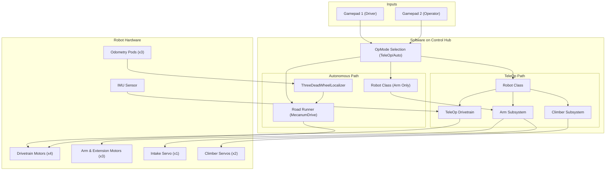
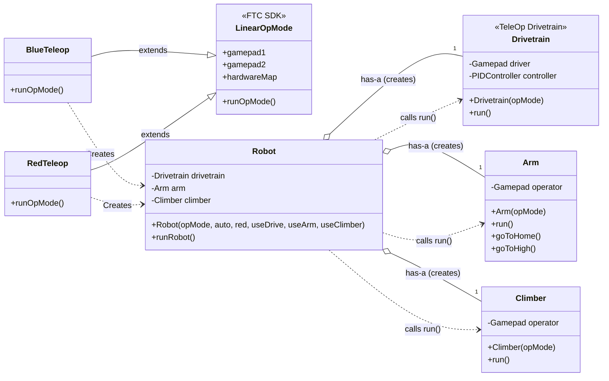
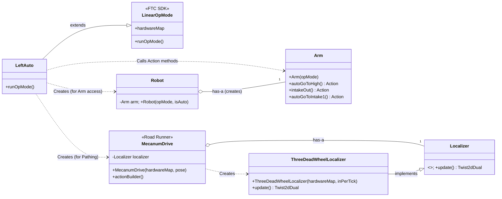

# Code Manual: FTC IntoTheDeep Robot

This document is a complete technical manual for the `IntoTheDeep` FTC codebase. It details the project architecture, user controls, file-by-file descriptions, and the complete workflow for creating new autonomous paths using Road Runner.

## Table of Contents

1. [Project Overview](#1-project-overview)
2. [Code Architecture](#2-code-architecture)
3. [Functional Block Diagram](#3-functional-block-diagram)
4. [Architecture Class Diagrams](#4-architecture-class-diagrams)
5. [User Controls Guide](#5-user-controls-guide)
6. [Autonomous & Pathing (Road Runner Guide)](#6-autonomous--pathing-road-runner-guide)
7. [File-by-File Code Description](#7-file-by-file-code-description)
8. [External Libraries and Resources](#8-external-libraries-and-resources)

---

## 1. Project Overview

This is a modular FTC robot codebase built for the `IntoTheDeep` season. The project is separated into distinct subsystems (like `Arm`, `Climber`, and two different `Drivetrain` classes) which are managed by a central `Robot.java` class.

This architecture creates two entirely separate modes of operation:

1.  **Autonomous:** Uses the **Road Runner (v1.0+ Action-Based)** library for highly precise, motion-profiled autonomous routines. This mode uses the `MecanumDrive.java` class and the `ThreeDeadWheelLocalizer.java` for high-accuracy odometry.
2.  **TeleOp:** Uses a separate, simpler `Drivetrain.java` class that leverages **FTCLib** kinematics for manual, "field-relative" driver control.

The code is managed by specific **OpModes** (e.g., `BlueTeleop`, `LeftAuto`) which act as the entry points and tell the main `Robot` class which subsystems to activate.

## 2. Code Architecture

The robot's software is split into two distinct execution flows: TeleOp (manual control) and Autonomous (pre-programmed control).

### TeleOp Execution Flow

In TeleOp, the flow is a continuous loop that reads gamepad inputs and updates all hardware.

1.  A driver selects `BlueTeleop` or `RedTeleop`.
2.  This OpMode creates a single `Robot` instance with `auto = false` and all subsystems set to `true`.
3.  The `Robot` constructor creates instances of the TeleOp **`Drivetrain.java`**, the **`Arm.java`**, and the **`Climber.java`** classes.
4.  The OpMode's main `while` loop continuously calls `robot.runRobot()`.
5.  `robot.runRobot()` then calls the individual `.run()` method for every active subsystem, processing gamepad inputs and updating motor states.

### Autonomous Execution Flow

Autonomous uses a sequential, action-based flow powered by Road Runner and ignores the TeleOp `Drivetrain`.

1.  A driver selects `LeftAuto`.
2.  This OpMode creates its **own** instance of Road Runner's **`MecanumDrive.java`**.
3.  It also creates a `Robot` instance with `auto = true`.
4.  Because `auto` is true, the `Robot` constructor **only initializes the `Arm`** and **skips** initializing the TeleOp `Drivetrain` and `Climber` classes.
5.  The OpMode builds a sequential chain of drive commands (e.g., `.strafeToLinearHeading(...)`) and mechanism commands (e.g., `robot.arm.autoGoToHigh()`).
6.  The entire sequence is executed once using `Actions.runBlocking()`.

## 3. Functional Block Diagram

This diagram shows the overall flow of information from user input to robot action. The architecture is intentionally split into two distinct paths—TeleOp and Autonomous—which are chosen by the **OpMode Selection** on the Driver Hub. This separation allows each path to be optimized for its specific task: TeleOp for real-time driver responsiveness and Autonomous for precision and repeatability.

* **Inputs:** The system begins with the drivers using the **Gamepads**.
* **Software (Control Hub):** The selected OpMode acts as a switch.
    * If a **TeleOp** OpMode is chosen, it activates the full `Robot` class, which processes live gamepad inputs to control all subsystems (Drivetrain, Arm, Climber). The TeleOp Drivetrain uses the IMU for field-relative control.
    * If an **Autonomous** OpMode is chosen, it activates a different software path. It uses **Road Runner** for drive motion, which gets its position data from the `ThreeDeadWheelLocalizer` (fed by the physical Odometry Pods). It also creates a limited `Robot` instance to gain control of just the `Arm` for mechanism actions during the path.
* **Hardware Outputs:** Both software paths ultimately send power commands to the physical motors and servos on the robot.



## 4. Architecture Class Diagrams

These diagrams illustrate the relationships between key classes in both operational modes.

### TeleOp Architecture Diagram

This shows the relationships during driver-controlled operation. The `TeleOp` OpMode creates a central `Robot` which manages all subsystems.



### Autonomous Architecture Diagram

This shows the relationships during autonomous. The `Auto` OpMode creates two separate primary objects: Road Runner's `MecanumDrive` (for pathing) and the `Robot` (to access the `Arm`).



## 5. User Controls Guide

This project assumes a two-driver setup.


### Gamepad 1: Driver Controls

This gamepad is dedicated exclusively to chassis movement and is managed by `Drivetrain.java`. All driving is **Field-Relative**.

| Control | Action | Source File | 
| :--- | :--- | :--- | 
| **Left Stick Y** | Drive Forward / Backward (relative to field) | `Drivetrain.java` | 
| **Left Stick X** | Strafe Left / Right (relative to field) | `Drivetrain.java` | 
| **Right Stick X** | Manually Turn (Rotate) robot Left / Right | `Drivetrain.java` | 
| **(A) Button** | PID Snap: Turn robot to **-45 degree** heading. | `Drivetrain.java` | 
| **(X) Button** | PID Snap: Turn robot to **+90 degree** heading. | `Drivetrain.java` | 
| **(B) Button** | PID Snap: Turn robot to **-90 degree** heading. | `Drivetrain.java` | 
| **Back Button** | Re-zeros the IMU heading. | `Drivetrain.java` | 

<br>

### Gamepad 2: Operator Controls

This gamepad controls all mechanisms via `Arm.java` and `Climber.java`.

#### Standard Mode (Default)

Controls available on startup.

| Control | Action | Source File(s) | 
| :--- | :--- | :--- | 
| **Left Trigger** (>50%) | Intake In (Power: 1.0) | `Arm.java` | 
| **Right Trigger** (>50%) | Intake Out (Power: -1.0) | `Arm.java` | 
| **(A) Button** | Arm Preset: `goToHome()` | `Arm.java` | 
| **(Y) Button** | Arm Preset: `goToHigh()` | `Arm.java` | 
| **(B) Button** | Arm Preset: `goToMid()` | `Arm.java` | 
| **(X) Button** | Arm Preset: `goToIntake()` | `Arm.java` | 
| **Left Stick** (Any) | Arm Preset: `furtherIntake()` | `Arm.java` | 
| **D-Pad Up** | Arm Preset: `raiseExtensionClimber()` | `Arm.java` | 
| **D-Pad Left** | **Climber Jacks:** Starts 8.4-second "Down" sequence. | `Climber.java` | 
| **D-Pad Right** | **(Dual Action)** <br> 1. **Arm:** Moves to `goToClimb()` position. <br> 2. **Climber Jacks:** Starts 8.4-second "Up" sequence. | `Arm.java`, `Climber.java` | 
| **D-Pad Down** | **Enter Climb Mode** (Disables all face buttons) | `Arm.java` | 
| **Back Button** | Reset all Arm motor encoders. | `Arm.java` | 

#### Climb Mode

This mode is active *after* **D-Pad Down** is pressed. All face buttons (A, B, X, Y) and the Left Stick are disabled.

| Control | Action | Source File | 
| :--- | :--- | :--- | 
| **Main Loop** | The arm automatically executes the `pullUp()` command. | `Arm.java` | 
| **Back Button** | **Exit Climb Mode** (Returns controls to Standard Mode) | `Arm.java` | 

## 6. Autonomous & Pathing (Road Runner Guide)

This project uses the modern Road Runner (v1.0+) "Action-Based" system. This means all autonomous commands (both drive and mechanisms) are built into a single sequence that is then executed.

### How to Create a New Autonomous File

This workflow explains how to use the project's tools to build a new auto routine.

#### Step 1: Generate Path with GUI Tool

Your project includes `RRPathGen-v1.8.1-alpha.jar`, a graphical tool for creating paths.

1.  **Run the Tool:** Execute this `.jar` file on your computer (requires Java). You can typically run it from a terminal with: `java -jar RRPathGen-v1.8.1-alpha.jar`.
2.  **Design Path:** The GUI will open, displaying the FTC field. Use your mouse to design a path:
    * **Left Click:** Add a new waypoint.
    * **Left Drag (on a point):** Move the waypoint.
    * **Alt + Left Click:** Change the robot's heading (angle) at that point.
    * **Shift + Alt + Left Click:** Change the path's departure tangent.
3.  **Export Code:** When your path looks correct, click the **"Export" button**. This copies the literal Java code needed to build that path.
4.  **Get Coordinates:** Alternatively, you can just use the GUI to find the exact coordinates and headings you want to use, and then manually type them into your OpMode. This is the method used by `LeftAuto.java`.

#### Step 2: Simulate the Path (Optional but Recommended)

Your project has a `MeepMeepTesting` module. You can copy your path coordinates into this file and run it on your desktop computer to get a 2D simulation of your robot's path before ever deploying it to the robot.

#### Step 3: Create the New Autonomous OpMode

1.  Navigate to the `TeamCode/src/main/java/org/firstinspires/ftc/teamcode/autos` directory.
2.  Create a new Java class (e.g., `MyNewAuto.java`).
3.  Use `LeftAuto.java` as a template. Your class must:
    * Have the `@Autonomous` annotation.
    * Extend `LinearOpMode`.
    * Initialize `MecanumDrive drive` and `Robot robot` (passing `true` for auto mode).
    * Set your `beginPose` (the robot's starting position).
    * Call `waitForStart()`.
4.  **Build Your Action Sequence:** This is the core of your program. All your drive and mechanism commands are chained together inside the `Actions.runBlocking()` command.

**Example Code Structure:**

```java
package org.firstinspires.ftc.teamcode.autos;

// ... other imports
import com.acmerobotics.roadrunner.Pose2d;
import com.acmerobotics.roadrunner.Vector2d;
import com.acmerobotics.roadrunner.ftc.Actions;
import com.qualcomm.robotcore.eventloop.opmode.Autonomous;
import com.qualcomm.robotcore.eventloop.opmode.LinearOpMode;
import org.firstinspires.ftc.teamcode.Robot;
import org.firstinspires.ftc.teamcode.drivetrain.MecanumDrive;

@Autonomous(name="MyNewAuto", group="Robot")
public final class MyNewAuto extends LinearOpMode {
    @Override
    public void runOpMode() throws InterruptedException {
        // 1. Initialize Objects (Road Runner drive and Robot mechanisms)
        Pose2d beginPose = new Pose2d(0, 0, Math.toRadians(0)); // Set your start pose
        MecanumDrive drive = new MecanumDrive(hardwareMap, beginPose);
        Robot robot = new Robot(this, true); // Initialize robot in AUTO mode

        waitForStart();

        /* -------------------------------------------------------------------------------------- */
        // 2. Build and Run the Action Sequence
        Actions.runBlocking(
            drive.actionBuilder(beginPose)
                // Drive Commands (from RRPathGen)
                .strafeToLinearHeading(new Vector2d(28, -4), Math.toRadians(43))
                
                // Mechanism Commands (from Arm.java)
                .stopAndAdd(robot.arm.intakeOut())
                .waitSeconds(1) // Drive Command
                .stopAndAdd(robot.arm.intakeIn())
                
                // Simultaneous Actions: Start moving AND lower arm 1 sec later
                .afterTime(1, robot.arm.autoGoToIntake1())
                .strafeToLinearHeading(new Vector2d(0, -39), Math.toRadians(0))
                
                // End sequence by going home
                .stopAndAdd(robot.arm.autoGoToHome())
                .build() // Finalize the action sequence
        );
    }
}
```

## 7. File-by-File Code Description

This is a breakdown of the key files in your project and their specific purpose.

### Core Robot Architecture

* **`Robot.java`**
    * **Purpose:** The central robot class. It acts as a conditional initializer and a dispatcher. During initialization, it checks if the robot is in `auto` or `TeleOp` mode and only creates the objects needed for that mode. In the main TeleOp loop, it dispatches the `.run()` command to each active subsystem, ensuring all components are updated in a consistent order on every cycle.
    * **Constructor Logic:**
        ```mermaid
        flowchart TD
            A[Robot Constructor Called] --> B{is 'auto' true?};
            B -- Yes --> C[Initialize Arm];
            B -- No --> D[Initialize TeleOp Drivetrain];
            D --> E[Initialize Arm];
            E --> F[Initialize Climber];
            C --> G[End];
            F --> G;
        ```

* **`Arm.java`**
    * **Purpose:** Manages the multi-motor arm, extension slides, and intake servo. Its core logic is a state machine controlled by the operator's gamepad. Instead of direct motor control, button presses transition the arm between predefined, encoder-based positions. This ensures repeatable movements. For autonomous, it provides special `Action` methods that wrap these state transitions, making them compatible with Road Runner's sequential command system.
    * **TeleOp State Machine Logic:**
        ```mermaid
        stateDiagram-v2
            [*] --> Home
            Home --> High: Y Button
            Home --> Mid: B Button
            Home --> Intake: X Button
            
            High --> Home: A Button
            Mid --> Home: A Button
            Intake --> Home: A Button

            state "Climb Mode" as Climb
            Home --> Climb: D-Pad Down
            Climb --> Home: Back Button
        ```

* **`Climber.java`**
    * **Purpose:** Manages the two climbing jack CR servos. This subsystem operates on a simple timed, "fire-and-forget" logic. When a D-Pad button is pressed, it sets a boolean flag and a timer. The `.run()` method checks this flag and runs the servos at full power for a hardcoded duration (8.4 seconds) before automatically stopping. It does not use any sensor feedback.

### OpModes (Entry Points)

* **`BlueTeleop.java` / `RedTeleop.java`**
    * **Purpose:** These are the primary entry points for the driver-controlled period. Their sole responsibility is to instantiate the main `Robot` class in the correct TeleOp configuration (`auto=false`) and then call the `robot.runRobot()` method in a continuous loop until the OpMode is stopped.

* **`LeftAuto.java` / `RightAuto.java`**
    * **Purpose:** These are the pre-programmed autonomous routines. They instantiate Road Runner's `MecanumDrive` and a limited version of the `Robot` class (for arm access). They use the `ActionBuilder` to create a single, sequential list of commands that mix drivetrain movements with mechanism actions. The entire sequence is executed blockingly from start to finish.

### Drivetrain & Localization

* **`MecanumDrive.java` (Road Runner)**
    * **Purpose:** This is the **Road Runner Autonomous Drivetrain**. It contains the kinematic model of the robot, motion profile constraints (max velocity/acceleration), and feedback controllers. During an autonomous path, its `FollowTrajectoryAction` loop constantly compares the robot's current position (from the `Localizer`) to the desired position on the pre-planned trajectory, calculates the necessary velocity to correct any error, and sends power commands to the motors.
    * **Data Flow:**
        ```mermaid
        graph TD
            A["Trajectory"] --> B["Holonomic Controller"];
            C["Localizer Output (Current Pose)"] --> B;
            B --> D{"Motor<br>Feedforward"};
            D --> E["Motor Powers"];
        ```

* **`Drivetrain.java` (TeleOp)**
    * **Purpose:** This is the **TeleOp Drivetrain** used for manual control. Its primary feature is "field-relative" driving, where it uses the IMU's heading to transform the driver's joystick inputs so that "forward" on the stick always moves the robot away from the driver. It also includes a separate logic path for snap-to-angle turning, using a PID controller to automatically rotate the robot to a predefined angle.
    * **Logic Flow:**
        ```mermaid
        flowchart TD
            A["Read Gamepad 1"] --> B{"Face Button Pressed?"};
            B -- Yes --> C["Get Target Angle"];
            C --> D["PID Controller"];
            D --> E["Calculate Turn Power"];
            B -- No --> F["Get Joystick Values"];
            F --> G["Apply Field-Relative<br>Transformation w/ IMU"];
            G --> H["Calculate Wheel Speeds"];
            E --> H;
            H --> I["Set Motor Powers"];
        ```

* **`ThreeDeadWheelLocalizer.java`**
    * **Purpose:** The high-precision **position tracking** module for autonomous. It reads the raw encoder values from the three unpowered odometry wheels. Using kinematic equations based on the physical placement of the pods, it calculates the robot's change in X (forward), Y (strafe), and heading (rotation) since the last update. This change, called a `Twist`, is sent to `MecanumDrive` to update the robot's position estimate.
    * **Data Flow:**
        ```mermaid
        graph TD
            A["Encoder Ticks<br>(Parallel 1, Parallel 2, Perpendicular)"] --> B["Kinematic Model"];
            B --> C["Output:<br>Twist2dDual (Δx, Δy, Δθ)"];
        ```

* **`Localizer.java`**: A Java `interface` (contract) that ensures any localizer class (like `ThreeDeadWheelLocalizer`) provides an `update()` method, making it compatible with `MecanumDrive`.
* **`Drawing.java`**: A small utility class used by Road Runner to draw the robot's pose on the FTC Dashboard field overlay for debugging.

## 8. External Libraries and Resources

This project relies on several key external libraries and tools.

* **FTC SDK:** The core robotics software development kit.
    * **Repository:** [github.com/FIRST-Tech-Challenge/FtcRobotController](https://github.com/FIRST-Tech-Challenge/FtcRobotController)
* **Road Runner:** The motion planning library used for all autonomous pathing.
    * **Documentation:** [rr.brott.dev](https://rr.brott.dev/docs/v1-0/introduction/)
    * **Tuning Video:** [Tutorial 5: Tuning Road Runner 1.0](https://www.youtube.com/watch?v=26ghjpkJwyM)
* **FTCLib:** The library used in the TeleOp drivetrain for kinematics and PID control.
    * **Documentation:** [docs.ftclib.org](https://docs.ftclib.org/ftclib/)
* **FTC Dashboard:** The web-based telemetry and tuning tool used with Road Runner.
    * **Repository:** [github.com/acmerobotics/ftc-dashboard](https://github.com/acmerobotics/ftc-dashboard)
* **MeepMeep:** The 2D desktop simulator used to visualize autonomous paths.
    * **Repository:** [github.com/noah-brott/MeepMeep](https://github.com/noah-brott/MeepMeep)
